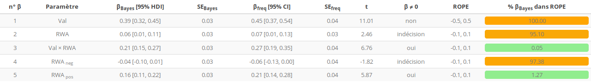

```{r}
curwd <- dirname(rstudioapi::getActiveDocumentContext()$path)
setwd(curwd)
```

This repository contains data and scripts for data analysis for the following article: 

Bret, A., Beffara, B., Mierop, A., & Mermillod, M. (2017, November 16). Differentiated evaluation of counter-conditioned stimuli as a function of right-wing authoritarianism. https://doi.org/10.31234/osf.io/3mfa8

#### Description of the different files and folders in the root of the repository:

- <span style="color:#5a3371">**Bayes_R2_MZ_function.R**</span> &rarr; a function to compute R2 for Bayesian ordinal models
- <span style="color:#5a3371">**effect_sizes.R**</span> &rarr; script used to compute effect sizes for our models/parameters of interest
- <span style="color:#5a3371">**ida**</span> &rarr; folder containing scripts for data analyses associated with the first IDA of the article (counter-conditioning)
- <span style="color:#5a3371">**ida_CE**</span> &rarr; folder containing scripts for data analyses associated with the second IDA of the article (conditioning)
- <span style="color:#5a3371">**xpXX**</span> &rarr; There is one folder for each experiment. Each folder contains scripts for data analyses for each individual study but these scripts are not useful in the context of the present article since only IDAs ar included. However **raw data** for each individual study can be found in these folders.

#### Description of the different files and sub-folders in the ida and ida_CE folder:

The name of the scripts start by a number. When running scripts for the first time, scripts should be run in the order indicated by these numbers.

- <span style="color:#5a3371">**01_merge_files.R**</span> &rarr; merges the .csv files (data frames) of each study ofr the IDA
- <span style="color:#5a3371">**02a_models_interaction.R**</span> &rarr; Bayesian ordinal models analysing the interaction between RWA and Valence for each individual study and the IDA.
- <span style="color:#5a3371">**02b_models_simple_neg.R**</span> &rarr; Bayesian ordinal models analysing the asociation between RWA and evaluation in the negative valence condition for each individual study and the IDA.
- <span style="color:#5a3371">**02c_models_simple_pos.R**</span> &rarr; Bayesian ordinal models analysing the asociation between RWA and evaluation in the positive valence condition for each individual study and the IDA.
- <span style="color:#5a3371">**03_lme4_models_ida.R**</span> &rarr; Frequentist metric models analysing the interaction between RWA and Valence for each individual study and the IDA (not necessary, analyses not included in the article).
- <span style="color:#5a3371">**04a_marg_plots_fitted_IDA**</span> &rarr; Plots from Bayesian ordinal models (e.g. see below)
{width=50%}
- <span style="color:#5a3371">**04b_marg_plots_linear_IDA.R**</span> &rarr; Spaghetti plots from Bayesian ordinal models
- <span style="color:#5a3371">**04c_plot_point_IDA.R**</span> &rarr; Plot data points and merge the spaghetti plot with the data plot (e.g. see below)
{width=50%}
- <span style="color:#5a3371">**05a_plot_ida_interact.R**</span> &rarr; Forest plot for the interaction (e.g. see below)
{width=50%}
- <span style="color:#5a3371">**05b_plot_ida_simple_neg.R**</span> &rarr; Forest plot for the simple slope of RWA in the negative condition (e.g. see below)
{width=50%}
- <span style="color:#5a3371">**05a_plot_ida_simple_pos.R**</span> &rarr; Forest plot for the simple slope of RWA in the positive condition (e.g. see below)
{width=50%}
- <span style="color:#5a3371">**05a_plot_ida_simple_pos.R**</span> and <span style="color:#5a3371">**kable_param_ida.Rmd**</span> &rarr; Produces html tables for the results of the IDA (e.g. see below). *This script should be ignored as it is no longer used in the final version of the article*.
{width=75%}
- <span style="color:#5a3371">**plots**</span> &rarr; Contains the plots of the article
- <span style="color:#5a3371">**tables**</span> &rarr; Contained the tables of the article. *This folder should be ignored as it is no longer used in the final version of the article*.
- <span style="color:#5a3371">**XPXX.csv**</span> &rarr; Data frame for each individual study

